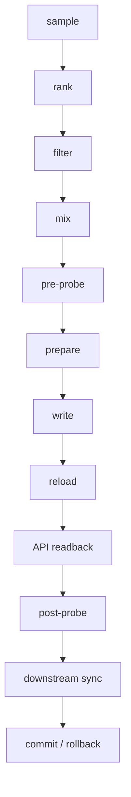

# Clash Arranger

[简体中文](README.md)

A safe arranger for the Mihomo/Clash ecosystem. It keeps a stable, ordered, rollback-safe `fallback` group using long-window throughput ranking and live liveness probes.

`v0.1.0` is experimental. It does not promise zero interruption.

## What it solves

Mihomo `url-test` rewrites the primary from instantaneous delay. Delay is not speed. This project keeps two truths apart:

1. **Score truth** — sustained throughput, loss, TLS/target reachability, red-sample ratio, sample count, confidence, inside a frozen `[start, end)` window.
2. **Liveness truth** — controller `delay` / `generate_204` right now. Liveness only, never speed.

The output is an ordered `fallback` list. The kernel fails over when a node dies. The arranger rewrites only on sustained slowness, sustained death, config drift, or correlated failure.

Precise claim:

> Front of historical throughput under health, confidence, region, and failure-domain constraints.

Not “the four fastest nodes on the internet”.

## Non-goals

- Chasing the lowest instant delay
- Hopping on a single delay sample
- Touching DNS, TUN, rules, Tailscale, or other groups
- Reading subscription URLs or storing secrets in-tree
- Auto-deploying onto anyone’s live network

## Architecture and data flow



See [docs/architecture.md](docs/architecture.md).

## Two truths

| Truth | Source | Use |
|-------|--------|-----|
| Score | Versioned JSONL, frozen `[start, end)` | Long-term ranking |
| Liveness | Controller delay, at least two rounds | Pre-seat veto / escape |

One failed delay is jitter. Two failed rounds is death. A high historical score is not current liveness.

## Sample schema

JSONL must include `schema_version` (currently `1`):

`ts`, `profile`, `site`, `node_id`, `provider`, `failure_domain`, `region`, `mbps`, `packet_loss_pct`, `target_ok`, `tls_ok`, `http_status`, `sample_valid`, `error_reason`

Failed rows must not join the median as `0 Mbps`. Error reasons include `timeout`, `tls_failed`, `target_failed`, `clip_too_short`, `insufficient_samples`.

Fictional boundary fixtures: [examples/samples.example.jsonl](examples/samples.example.jsonl).

## Fixed windows

Half-open `[start, end)`. Timezone is required. Re-running a shift reuses the same window. Samples after the end must not change that window. Tag cutoffs freeze at the exclusive end.

Workstation example:

| Shift | Kind | Interval |
|-------|------|----------|
| morning | previous day | `[09:00, 17:00)` |
| midday | today | `[09:00, 12:30)` |
| evening | previous day | `[17:00, 23:01)` |
| evening-mid | today | `[17:00, 19:30)` |

The router example has two daily shifts. Times come from config.

```mermaid
gantt
  title Half-open windows Asia/Taipei
  dateFormat HH:mm
  axisFormat %H:%M
  section previous day
  morning [09:00,17:00) :09:00, 8h
  evening [17:00,23:01) :17:00, 6h
  section today
  midday [09:00,12:30)  :09:00, 3.5h
  evening-mid [17:00,19:30) :17:00, 2.5h
```

## Tags, confidence, mixing

Internal enums: `blocked` / `brittle` / `hardy` / `watch`. Display text may be localized.

Confidence: `high` / `normal` / `degraded` / `none`. Low-sample candidates follow an explicit degrade policy. Every filter reason is structured in logs.

Mixing is a generic provider / failure-domain constraint, not a branded `2+2`. Configure seat count, per-provider min/max, region allow-list, exit-IP dedupe, upstream dedupe, and whether unknown providers are allowed. The default example is four seats, two providers × two. A short pool degrades to `3+1` and logs why. Order: `filter -> confidence gate -> mix -> assert`. Disabled nodes cannot be filled back in.

## Fallback, escape, sustained promotion

The target group must be ordered `fallback`. The kernel handles death. The arranger handles slow seating.

Probe at least twice before write and again after. A post-write failure is not success: roll back or try the next escape set. Several consecutive deaths trigger mass-failure escape. Single-node jitter uses cycle thresholds, isolation, recovery streaks, and rewrite cooldown.

If the primary is alive but paired throughput stays worse, a healthier backup can be promoted to first. Only same-timestamp pairs count; they must span enough time and beat both ratio and absolute-gain thresholds. Defaults live in [docs/configuration.md](docs/configuration.md). A single delay sample is not speed.

## Transactions, rollback, security

Default is dry-run. Real writes need `--apply`. Human writes also need `--force-manual`. Only the target group is text-patched. Never `yaml.dump()` the whole document. Snapshot first; verify disk, API, optional downstream, and post-apply probes.

Success: `disk == API == downstream` and post-probe pass. If a phone app hot-reload cannot be observed, do not pretend it confirmed, and do not block a successful file transaction. A reload disconnect is a soft failure only when disk/API already match and later probes pass; otherwise fail or roll back.

CAS, exclusive locks, idempotent reruns, bounded retries, catch-up, manual lease, and explicit exit codes are supported. After a human pin, ordinary optimization only observes; mass failure may still escape.

Secrets come only from the environment, a keychain item, or a `0600` file.

## Support matrix

| Capability | Status |
|------------|--------|
| macOS + Ubuntu CI / Python 3.11–3.12 | Tested |
| `mihomo-local` / `stash-file` / `openclash-ssh` (injectable runner) | Tested with fakes / tempdirs |
| Windows, real SSH, live controllers | Not claimed |

Requires Python 3.11+ and PyYAML. The core stays pure Python.

## Five-minute Quick Start (fixtures, no live writes)

```bash
python3 -m venv .venv
source .venv/bin/activate
python -m pip install -e ".[dev]"
python -m clash_arranger doctor --config examples/workstation.example.yaml
python -m clash_arranger sample --config examples/workstation.example.yaml
python -m clash_arranger rank --config examples/workstation.example.yaml --window morning --now 2026-09-16T09:25:00+08:00
python -m clash_arranger plan --config examples/workstation.example.yaml --window morning --now 2026-09-16T09:25:00+08:00
python -m clash_arranger apply --config examples/workstation.example.yaml --window morning --now 2026-09-16T09:25:00+08:00
```

The last command has no `--apply`. The first run must not write a live network.

## Config, dry-run, schedulers

Full table: [docs/configuration.md](docs/configuration.md).

```bash
clash-arranger --config your.yaml --window morning --scheduled --apply apply
clash-arranger --config your.yaml --window morning --force-manual --apply apply
```

macOS LaunchAgent: [examples/launchd/](examples/launchd/).  
Linux systemd / cron: [examples/systemd/](examples/systemd/), [examples/cron/router.cron](examples/cron/router.cron).  
OpenClash source of truth and downstream YAML: [docs/deployment.md](docs/deployment.md).

Workstation example: shifts can be weekdays only; weekends no-op before any controller, probe, or downstream access.  
Router example: two daily shifts plus all-day health, including weekends.

## Logs, status, troubleshooting, privacy

State files live under `state_dir`: `status.json`, `health.json`, `manual-lease.json`. Do not commit them or real JSONL.

Troubleshooting: [docs/troubleshooting.md](docs/troubleshooting.md).  
Privacy: no telemetry. Examples use fictional names only (`provider-a`, `SG-A1`, `127.0.0.1:9090`). Do not paste live subscriptions or node tables into issues.

Limits: phone-app hot reload is unobservable; no provider is guaranteed; first release is experimental.

## Development, contributing, license

```bash
ruff format
ruff check
mypy
pytest
python scripts/check_readme_links.py
```

See [CONTRIBUTING.md](CONTRIBUTING.md), [CODE_OF_CONDUCT.md](CODE_OF_CONDUCT.md), [SECURITY.md](SECURITY.md), [CHANGELOG.md](CHANGELOG.md).

Apache-2.0. Runtime dependency PyYAML is MIT and compatible. See [LICENSE](LICENSE).
