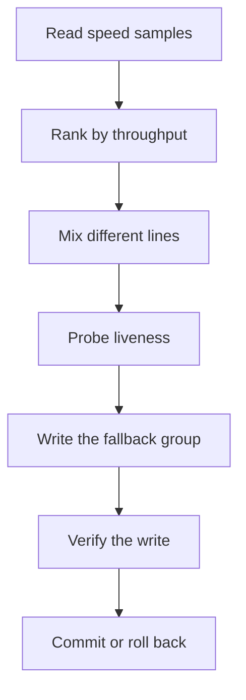

# Clash Arranger

[简体中文](README.md)

A command-line tool for [Mihomo](https://github.com/MetaCubeX/mihomo) / Clash.

It does one job: rank nodes in **one** `fallback` proxy group from **download speed measured over a stretch of time**, then ask the controller “is this node alive right now?” before writing.

Mihomo `url-test` ranks on instant delay. Low delay is not high throughput, and it is not stability. This project keeps those two questions apart.

`v0.1.0` is experimental. **It does not promise zero interruption.** The default is print-only; it will not touch a live config unless you say so.

## What it changes

Only the node list and order of **one** `fallback` group you name. It does not touch DNS, TUN, routing rules, other groups, or subscription URLs.

If a node dies this second, Mihomo still fails over down the `fallback` list. This tool does not do instant switching. It decides who should sit in front over the next stretch of time.



Details: [docs/architecture.md](docs/architecture.md).

## What it will not do

- Hop nodes because of a single ping
- Claim “the four fastest nodes on the internet”
- Read subscription URLs or store secrets in the repo
- Auto-deploy onto anyone’s live network
- Observe whether a phone app hot-reloaded — and it will not pretend it did

## Five-minute run (fixtures, no live writes)

Python 3.11+. Example node names and `127.0.0.1:9090` are fictional.

```bash
python3 -m venv .venv
source .venv/bin/activate
python -m pip install -e ".[dev]"
python -m clash_arranger doctor --config examples/workstation.example.yaml
python -m clash_arranger sample --config examples/workstation.example.yaml
python -m clash_arranger rank --config examples/workstation.example.yaml --window morning --now 2026-09-16T09:25:00+08:00
python -m clash_arranger plan --config examples/workstation.example.yaml --window morning --now 2026-09-16T09:25:00+08:00
python -m clash_arranger apply --config examples/workstation.example.yaml --window morning --now 2026-09-16T09:25:00+08:00
```

| Command | What it does |
|---------|----------------|
| `doctor` | Can the example config be read? |
| `sample` | Load the example speed records |
| `rank` | Rank by throughput in that window |
| `plan` | Print a proposed order, write nothing |
| `apply` | Still write nothing: dry-run unless you pass `--apply` |

Fixture rows: [examples/samples.example.jsonl](examples/samples.example.jsonl).

## When you really want a write

```bash
clash-arranger --config your.yaml --window morning --scheduled --apply apply
clash-arranger --config your.yaml --window morning --force-manual --apply apply
```

No `--apply` means plan only. A human live write also needs `--force-manual`.

Writes are a text patch of that one group, never a full `yaml.dump()`. Snapshot first; verify the file and the controller; roll back on failure.

Config keys: [docs/configuration.md](docs/configuration.md). Wiring Mihomo, a downstream file, or OpenClash: [docs/deployment.md](docs/deployment.md).

Example schedulers:

- macOS LaunchAgent: [examples/launchd/](examples/launchd/)
- Linux systemd / cron: [examples/systemd/](examples/systemd/), [examples/cron/router.cron](examples/cron/router.cron)

The workstation example can no-op on weekends. The router example runs morning and evening every day, plus all-day liveness checks.

## Ranking, short version

Samples are JSONL rows and must include `schema_version`. A failed row must not enter the ranking as `0 Mbps`, or a timeout looks like a stable zero-speed node.

Only samples inside the configured time window count. After ranking it still:

- drops nodes that are clearly unfit
- avoids filling the list from one provider / one exit
- probes twice before write; one miss is jitter, two misses is dead
- promotes a backup to first only if the primary stays alive but is lastingly slower

Thresholds live in the configuration doc, not on this page.

## What is tested

| Capability | Status |
|------------|--------|
| macOS + Ubuntu CI, Python 3.11–3.12 | Tested |
| Local Mihomo API, file sync, injectable OpenClash SSH | Tested with fakes / tempdirs |
| Windows, real SSH, live controllers | Not claimed |

Secrets come from an environment variable, a keychain item, or a `0600` file. Troubleshooting: [docs/troubleshooting.md](docs/troubleshooting.md).

Do not paste live subscriptions, node tables, or home topology into issues. Examples use fake names only: `provider-a`, `SG-A1`, `127.0.0.1:9090`.

## Development and license

```bash
ruff format
ruff check
mypy
pytest
python scripts/check_readme_links.py
```

[CONTRIBUTING.md](CONTRIBUTING.md) · [CODE_OF_CONDUCT.md](CODE_OF_CONDUCT.md) · [SECURITY.md](SECURITY.md) · [CHANGELOG.md](CHANGELOG.md)

Apache-2.0. Runtime dependency PyYAML is MIT and compatible. See [LICENSE](LICENSE).
