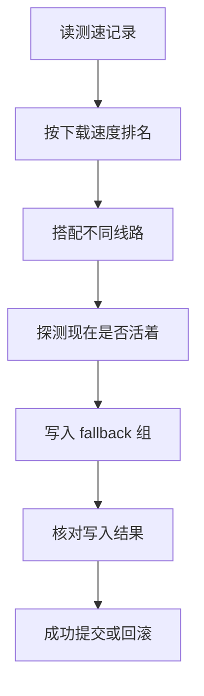

# Clash 节点编排器

[English](README.en.md)

给 [Mihomo](https://github.com/MetaCubeX/mihomo) / Clash 用的命令行工具。

它只做一件事：根据**一段时间里真正测到的下载速度**，给你指定的 `fallback` 代理组排好节点顺序；写入前再问控制器「现在还活着吗」。

Clash 自带的 `url-test` 看的是瞬时延迟。延迟低不等于下载快，更不等于稳。这个工具把两件事拆开：谁这段时间更快，以及谁这一刻还活着。

`v0.1.0` 是实验性首版，**不保证零中断**。默认只打印计划，不会改你正在用的配置。

## 它实际会动什么

只改你配置里**一个** `fallback` 组里的节点名单和顺序。不改 DNS、TUN、分流规则、其他代理组，也不去拉订阅。

节点突然挂了，还是 Mihomo 自己按 `fallback` 顺序往下切。本工具不管瞬时切换，管的是过一段时间谁该排在前面。

流程：



更细的分层见 [docs/architecture.md](docs/architecture.md)。

## 它不会做的事

- 不按一次 ping 给你换节点
- 不宣称「全网最快四个」
- 不读取订阅链接，不把密钥写进仓库
- 不自动部署到任何人的现网
- 看不到手机 App 有没有热加载成功，也不会假装看到了

## 五分钟跑通（假数据，不写现网）

需要 Python 3.11+。示例里的节点名、`127.0.0.1:9090` 都是虚构的。

```bash
python3 -m venv .venv
source .venv/bin/activate
python -m pip install -e ".[dev]"
python -m clash_arranger doctor --config examples/workstation.example.yaml
python -m clash_arranger sample --config examples/workstation.example.yaml
python -m clash_arranger rank --config examples/workstation.example.yaml --window morning --now 2026-09-16T09:25:00+08:00
python -m clash_arranger plan --config examples/workstation.example.yaml --window morning --now 2026-09-16T09:25:00+08:00
python -m clash_arranger apply --config examples/workstation.example.yaml --window morning --now 2026-09-16T09:25:00+08:00
```

| 命令 | 作用 |
|------|------|
| `doctor` | 检查示例配置能不能读 |
| `sample` | 读示例测速记录 |
| `rank` | 按这段时间的吞吐排名 |
| `plan` | 给出建议的节点顺序，不写文件 |
| `apply` | 同样不写文件：默认 dry-run，没有 `--apply` 就不会改配置 |

假数据在 [examples/samples.example.jsonl](examples/samples.example.jsonl)。

## 真要写进配置时

```bash
# 定时任务用
clash-arranger --config your.yaml --window morning --scheduled --apply apply
# 你自己手动点一次
clash-arranger --config your.yaml --window morning --force-manual --apply apply
```

没有 `--apply` 就只看计划。人工真写还要 `--force-manual`，防止手滑。

写的时候只补丁那一个组的几行文本，不会整份 `yaml.dump()`。写前快照，写后核对文件和控制器；失败就回滚。

配置项说明：[docs/configuration.md](docs/configuration.md)。怎么接到本机 Mihomo、文件型下游或 OpenClash：[docs/deployment.md](docs/deployment.md)。

示例调度：

- macOS LaunchAgent：[examples/launchd/](examples/launchd/)
- Linux systemd / cron：[examples/systemd/](examples/systemd/)、[examples/cron/router.cron](examples/cron/router.cron)

工作站示例可以设成只在工作日跑，周末直接退出。路由器示例则是每天早晚各一次，外加全天探活。

## 排位怎么算（短版）

测速记录是一行一条的 JSONL，要带 `schema_version`。失败的记录不能当成 `0 Mbps` 去排名，否则超时的节点会看起来「很稳的零速」。

排名只看你配置的时间窗里的数据，过点的样本不算进这一次。排好名之后还会：

- 丢掉明显不行的节点
- 尽量让名单里不全是同一家、同一条出口
- 写入前连探两轮；一轮失败当抖动，两轮都失败才当死
- 主节点还活着、但长期明显更慢时，才考虑把备用提到第一位

完整规则和阈值在配置文档里，不在这一页展开。

## 现在测过什么

| 能力 | 状态 |
|------|------|
| macOS + Ubuntu CI，Python 3.11–3.12 | 已测 |
| 本机 Mihomo API、文件同步、可注入的 OpenClash SSH | 用假服务 / 临时目录测过 |
| Windows、真 SSH、真控制器 | 没宣称支持 |

密钥只来自环境变量、系统钥匙串，或权限 `0600` 的外部文件。排查：[docs/troubleshooting.md](docs/troubleshooting.md)。

不要把真实订阅、节点表、家里的网段贴进 issue。示例一律是假名：`provider-a`、`SG-A1`、`127.0.0.1:9090`。

## 开发与许可证

```bash
ruff format
ruff check
mypy
pytest
python scripts/check_readme_links.py
```

[CONTRIBUTING.md](CONTRIBUTING.md) · [CODE_OF_CONDUCT.md](CODE_OF_CONDUCT.md) · [SECURITY.md](SECURITY.md) · [CHANGELOG.md](CHANGELOG.md)

Apache-2.0。运行时依赖 PyYAML（MIT），兼容。见 [LICENSE](LICENSE)。
