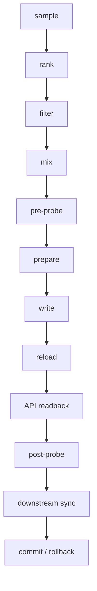

# Clash 节点编排器

[English](README.en.md)

面向 Mihomo/Clash 生态的安全自动编排器：用长期吞吐排位和实时存活探针，维护一个稳定、有序、可回滚的 `fallback` 节点组。

`v0.1.0` 是实验性首版，不承诺零中断。

## 它解决什么

Mihomo 的 `url-test` 会按瞬时 delay 改主节点。delay 不是速度。本项目把两套真相分开：

1. **分数真相**：持续吞吐、丢包、TLS/目标站可达、红样本比例、样本数与置信度、固定历史窗。
2. **存活真相**：控制器实时 `delay` / `generate_204`。只判断此刻活着，不当测速。

输出是有序 `fallback`：主节点快且稳；主节点死亡时由内核顺延；外部守护进程只在持续慢、持续死亡、配置漂移或多节点共故障时事务性重排。

准确表达：

> 健康、置信度、地区和故障域约束下的历史吞吐前排。

不是「全网最快四个」。

## 非目标

- 不追求瞬时最低延迟
- 不根据一次 delay 跳节点
- 不改 DNS、TUN、规则、Tailscale 或其他策略组
- 不读取订阅链接，不把 secret 写进仓库
- 不自动部署到任何人的现网

## 架构与数据流



详见 [docs/architecture.md](docs/architecture.md)。

## 两套真相

| 真相 | 来源 | 用途 |
|------|------|------|
| 分数 | 版本化 JSONL，固定 `[start, end)` 窗 | 长期排位 |
| 存活 | 控制器 delay 探针，至少两轮 | 落座前否决 / 逃生 |

一次 delay 失败是抖动；两轮全失败才判死。历史分数高不能宣布当前存活。

## 样本 schema

JSONL，必须带 `schema_version`（当前为 `1`）：

`ts`, `profile`, `site`, `node_id`, `provider`, `failure_domain`, `region`, `mbps`, `packet_loss_pct`, `target_ok`, `tls_ok`, `http_status`, `sample_valid`, `error_reason`

失败样本不得伪装成 `0 Mbps` 参与中位数。错误原因至少区分：`timeout`、`tls_failed`、`target_failed`、`clip_too_short`、`insufficient_samples`。

虚构边界样本见 [examples/samples.example.jsonl](examples/samples.example.jsonl)。

## 固定窗口

半开区间 `[start, end)`。时区必须配置。同一班次重跑使用同一窗口；窗结束后到达的样本不得改写该窗。标签截止时刻冻结在窗口结束时刻。

工作站示例：

| 班次 | 种类 | 区间 |
|------|------|------|
| morning | 前一日 | `[09:00, 17:00)` |
| midday | 当日 | `[09:00, 12:30)` |
| evening | 前一日 | `[17:00, 23:01)` |
| evening-mid | 当日 | `[17:00, 19:30)` |

路由器示例只有每天早晚两班，窗口来自配置，不是硬编码习惯。

## 标签、置信度、混部

内部枚举：`blocked` / `brittle` / `hardy` / `watch`。展示文本可本地化。

置信度：`high` / `normal` / `degraded` / `none`。低样本只能按配置降级使用。过滤原因进入结构化日志。

混部是通用 failure-domain / provider 约束，不是某个机场 `2+2`。可配置席位数、每家最少/最多、地区白名单、同出口 IP 去重、同上游去重、未知 provider 是否允许。默认示例：四席、两家各两席；短池降级为 `3+1` 并写明日志。顺序固定：`filter -> confidence gate -> mix -> assert`。禁用节点不会被补位带回。

## fallback、逃生、持续慢晋升

目标组必须是有序 `fallback`。内核负责死亡顺延；编排器负责慢周期席位。

落座前至少两轮探针；写后再探。写后失败不得宣布成功，必须回滚或试下一组 escape set。连续多根死亡立即 mass-failure 逃生。单根抖动有连续周期门槛、隔离、恢复连胜、重写冷却。

主节点活着但配对吞吐持续落后时，可把更快备选持久提到第一位。只比较同一时间戳的配对样本，必须跨足够时间，连续满足倍率和绝对增益，候选始终健康。阈值见 [docs/configuration.md](docs/configuration.md)。单次 delay 不能代表速度。

## 事务、回滚、安全模型

默认 dry-run。真写要 `--apply`。人工真写还要 `--force-manual`。只对目标组做文本级最小补丁，禁止 `yaml.dump()` 整份重写。写前快照，写后校验磁盘、API、可选下游、落座后探针。

成功：`disk == API == downstream` 且 post-probe 通过。无法观测手机 App 热加载时，不伪装成已确认，也不阻止「下游文件事务成功」。reload 断连接仅在磁盘/API 已一致且后续探针通过时降级；否则失败或回滚。

支持 CAS、防并发锁、幂等重跑、有限重试、断点、catch-up、manual lease、明确退出码。人工拨钉后普通优化只观察，mass failure 仍可逃生。

Secret 只来自环境变量、钥匙串或 `0600` 外部文件。

## 支持矩阵

| 能力 | 状态 |
|------|------|
| macOS + Ubuntu CI / Python 3.11–3.12 | 已测 |
| `mihomo-local` / `stash-file` / `openclash-ssh`（SSH 可注入） | 已测（fake server / tempdir） |
| Windows、真实 SSH、真实控制器 | 未宣称支持 |

系统要求：Python 3.11+，PyYAML。核心保持纯 Python。

## 五分钟 Quick Start（fixture，不写现网）

```bash
python3 -m venv .venv
source .venv/bin/activate
python -m pip install -e ".[dev]"
python -m clash_arranger doctor --config examples/workstation.example.yaml
python -m clash_arranger sample --config examples/workstation.example.yaml
python -m clash_arranger rank --config examples/workstation.example.yaml --window morning --now 2026-09-16T09:25:00+08:00
python -m clash_arranger plan --config examples/workstation.example.yaml --window morning --now 2026-09-16T09:25:00+08:00
python -m clash_arranger apply --config examples/workstation.example.yaml --window morning --now 2026-09-16T09:25:00+08:00
```

最后一条没有 `--apply`，只做 dry-run。第一次运行不应写现网。

## 配置、dry-run、调度

完整表： [docs/configuration.md](docs/configuration.md)。

```bash
# 真写（调度）
clash-arranger --config your.yaml --window morning --scheduled --apply apply
# 人工真写
clash-arranger --config your.yaml --window morning --force-manual --apply apply
```

macOS LaunchAgent 示例： [examples/launchd/](examples/launchd/)。  
Linux systemd / cron： [examples/systemd/](examples/systemd/)、[examples/cron/router.cron](examples/cron/router.cron)。  
OpenClash 真源与下游 YAML： [docs/deployment.md](docs/deployment.md)。

工作站示例：班次可配置为仅工作日；周末在访问控制器、探针和下游文件之前直接 no-op。  
路由器示例：每天早晚两班 + 全天健康巡检，不区分周末。

## 日志、状态、排查、隐私

状态文件在配置的 `state_dir`：`status.json`、`health.json`、`manual-lease.json`。不要提交这些文件或真实 JSONL。

排查： [docs/troubleshooting.md](docs/troubleshooting.md)。  
隐私与限制：不收集遥测；示例全是虚构名（`provider-a`、`SG-A1`、`127.0.0.1:9090`）。不要把真实订阅、节点表、家庭拓扑贴进 issue。

限制：观察不到手机 App 是否热加载；不保证任何机场或线路；首版实验性。

## 开发、贡献、许可证

```bash
ruff format
ruff check
mypy
pytest
python scripts/check_readme_links.py
```

见 [CONTRIBUTING.md](CONTRIBUTING.md)、[CODE_OF_CONDUCT.md](CODE_OF_CONDUCT.md)、[SECURITY.md](SECURITY.md)、[CHANGELOG.md](CHANGELOG.md)。

Apache-2.0。运行时依赖 PyYAML（MIT），兼容。详见 [LICENSE](LICENSE)。
